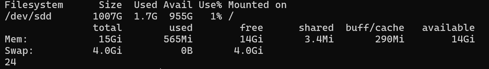
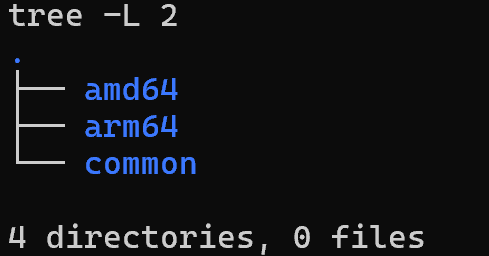
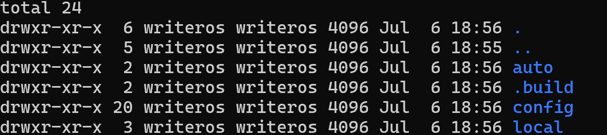
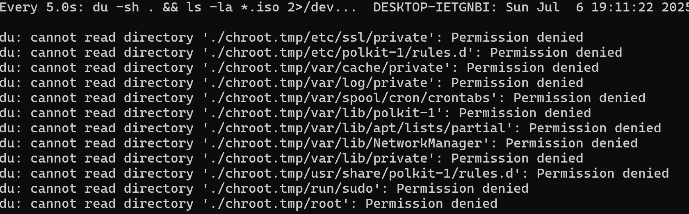
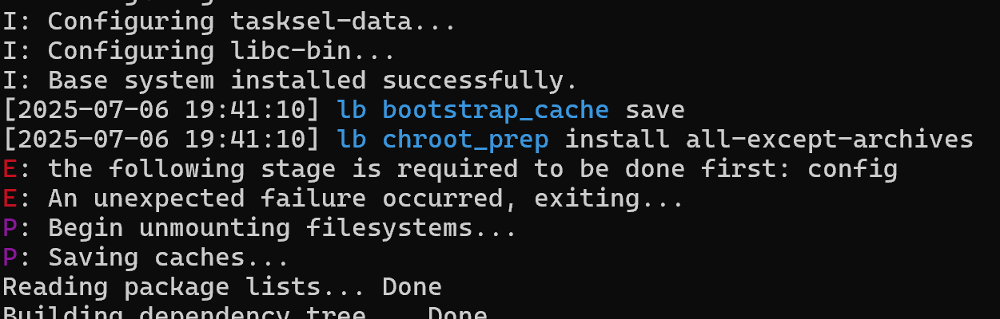

# Live Build 환경 구축 가이드

WriterOS 프로토타입을 실제 부팅 가능한 ISO 이미지로 빌드하기 위한 Live Build 환경을 구축합니다.

## 📋 사전 준비사항

### 확인해야 할 것들
- ✅ WSL2 + Debian 환경 구축 완료 ([01-wsl2-setup.md](01-wsl2-setup.md) 참고)
- ✅ sudo 권한 확보 완료
- ✅ 기본 개발 도구 설치 완료
- ✅ 디스크 여유 공간 최소 10GB (ISO 빌드용)

### 시스템 요구사항
```bash
# 현재 환경 확인
df -h ~          # 디스크 공간 (10GB+ 필요)
free -h          # 메모리 (4GB+ 권장)
nproc            # CPU 코어 수 (멀티코어 권장)
```

## Step 1: Live Build 패키지 설치 확인

### 설치된 패키지 확인
```bash
# Live Build 관련 패키지 확인
dpkg -l | grep -E "(live-build|debootstrap)"

# 예상 출력:
# ii  debootstrap    1.0.128+nmu2  all   Bootstrap a basic Debian system
# ii  live-build     1:20230502    all   Live System Build Components
```

### 추가 필수 패키지 설치
```bash
# 빌드에 필요한 추가 도구들
sudo apt update
sudo apt install -y \
    live-build \
    debootstrap \
    squashfs-tools \
    genisoimage \
    syslinux-utils \
    isolinux \
    memtest86+ \
    rsync \
    git

# 설치 확인
which lb           # /usr/bin/lb
which debootstrap  # /usr/sbin/debootstrap
which mksquashfs   # /usr/bin/mksquashfs
```

## Step 2: 작업 디렉토리 구성

### WriterOS 빌드 디렉토리 생성
```bash
# 홈 디렉토리로 이동
cd ~

# WriterOS 빌드 디렉토리 구조 생성
mkdir -p writeros-build/{amd64,arm64,common}
cd writeros-build

# 디렉토리 구조 확인
tree -L 2
```

**예상 출력**:
```
writeros-build/
├── amd64/
├── arm64/
└── common/
```

### AMD64 빌드 환경 초기화
```bash
# AMD64 빌드 디렉토리로 이동
cd ~/writeros-build/amd64

# Live Build 프로젝트 초기화
lb config \
    --architectures amd64 \
    --distribution bookworm \
    --archive-areas "main contrib non-free non-free-firmware" \
    --linux-flavours amd64 \
    --bootappend-live "boot=live components quiet splash" \
    --bootloader syslinux \
    --binary-images iso-hybrid \
    --cache-packages true \
    --cache-stages true \
    --debian-installer false

# 생성된 설정 확인
ls -la
```

**생성되는 파일들**:
```
auto/           # 자동 빌드 스크립트들
config/         # 상세 설정 파일들
.build/         # 빌드 상태 정보
```

## Step 3: WriterOS 기본 설정 구성

> **⚠️ 중요**: 패키지 목록과 Hook 스크립트에는 **영문 주석만** 사용하세요!  
> 한글 주석은 Live Build 파싱 에러를 유발할 수 있습니다.

### 패키지 목록 정의
```bash
# 기본 패키지 목록 생성
cat > config/package-lists/writeros-base.list.chroot << 'EOF'
# Base system
live-boot
live-config
live-config-systemd

# Networking
network-manager
wireless-tools
wpasupplicant

# Korean language support
fonts-noto-cjk
fonts-nanum
fcitx5
fcitx5-hangul
fcitx5-config-qt

# Text editors
neovim
nano

# Basic utilities
curl
wget
git
htop
tree
unzip
file

# Minimal X11 environment
xserver-xorg-core
xinit
openbox
xterm

# Power management
acpi
acpid
tlp
powertop
EOF
```

### 개발 도구 패키지 (선택사항)
```bash
# 개발 도구 패키지 목록
cat > config/package-lists/writeros-dev.list.chroot << 'EOF'
# Development tools
build-essential
gcc
make
cmake
python3
python3-pip
nodejs
npm

# Debugging tools
gdb
strace
tcpdump
wireshark-common
EOF
```

### 시스템 설정 hook 생성
```bash
# config 디렉토리 생성
mkdir -p config/hooks/live

# 기본 시스템 설정 hook
cat > config/hooks/live/0010-writeros-config.hook.chroot << 'EOF'
#!/bin/bash

# WriterOS basic configuration script

echo "=== WriterOS Basic Setup Started ==="

# Create default user (writeros)
useradd -m -s /bin/bash -G sudo,audio,video,plugdev writeros
echo "writeros:writeros" | chpasswd

# Auto login configuration
mkdir -p /etc/systemd/system/getty@tty1.service.d
cat > /etc/systemd/system/getty@tty1.service.d/autologin.conf << 'CONF'
[Service]
ExecStart=
ExecStart=-/sbin/agetty --autologin writeros --noclear %I $TERM
CONF

# Korean input method configuration
mkdir -p /home/writeros/.config/fcitx5
cat > /home/writeros/.config/fcitx5/config << 'FCITX5_CONF'
[Hotkey]
TriggerKeys=
ActivateKeys=Hangul
FCITX5_CONF

chown -R writeros:writeros /home/writeros/.config

# Power management optimization
systemctl enable tlp
systemctl enable acpid

# Disable unnecessary services
systemctl disable bluetooth
systemctl disable cups
systemctl disable NetworkManager-wait-online

echo "=== WriterOS Basic Setup Completed ==="
EOF

# 실행 권한 부여
chmod +x config/hooks/live/0010-writeros-config.hook.chroot
```

### Neovim 설정 추가
```bash
# Neovim 기본 설정 hook
cat > config/hooks/live/0020-neovim-setup.hook.chroot << 'EOF'
#!/bin/bash

echo "=== Neovim Setup Started ==="

# Neovim configuration for writeros user
mkdir -p /home/writeros/.config/nvim

cat > /home/writeros/.config/nvim/init.lua << 'NVIM_CONFIG'
-- WriterOS Neovim basic configuration

-- Basic options
vim.opt.number = true           -- Show line numbers
vim.opt.relativenumber = true   -- Show relative line numbers
vim.opt.tabstop = 4            -- Tab width
vim.opt.shiftwidth = 4         -- Indent width
vim.opt.expandtab = true       -- Use spaces for tabs
vim.opt.wrap = true            -- Line wrapping
vim.opt.linebreak = true       -- Word-wise line breaking

-- Korean language support
vim.opt.encoding = 'utf-8'
vim.opt.fileencoding = 'utf-8'

-- Search settings
vim.opt.ignorecase = true      -- Case insensitive search
vim.opt.smartcase = true       -- Smart case search

-- Basic keymap
vim.g.mapleader = ' '          -- Set leader key to space

-- Simple key bindings
vim.keymap.set('n', '<leader>w', ':w<CR>', { desc = 'Save file' })
vim.keymap.set('n', '<leader>q', ':q<CR>', { desc = 'Quit' })

print("WriterOS Neovim loaded!")
NVIM_CONFIG

chown -R writeros:writeros /home/writeros/.config

echo "=== Neovim Setup Completed ==="
EOF

chmod +x config/hooks/live/0020-neovim-setup.hook.chroot
```

## Step 4: 빌드 테스트

### 첫 번째 테스트 빌드
```bash
# AMD64 빌드 디렉토리에서
cd ~/writeros-build/amd64

# 빌드 시작 (시간이 오래 걸림: 30분-1시간)
echo "=== WriterOS AMD64 빌드 시작 ==="
time sudo lb build

# 빌드 진행 상황 모니터링 (다른 터미널에서)
watch -n 5 'du -sh . && ls -la *.iso 2>/dev/null || echo "빌드 진행 중..."'
```

**빌드 과정 단계들**:
```
1. bootstrap    # 기본 Debian 시스템 다운로드
2. chroot       # 패키지 설치 및 설정
3. binary       # ISO 이미지 생성
4. source       # 소스 패키지 생성 (선택사항)
```

### 빌드 결과 확인
```bash
# 빌드 완료 후 확인
ls -lah *.iso

# 예상 출력:
# -rw-r--r-- 1 root root 890M 날짜 시간 live-image-amd64.hybrid.iso

# ISO 정보 확인
file live-image-amd64.hybrid.iso
# live-image-amd64.hybrid.iso: ISO 9660 CD-ROM filesystem data (DOS/MBR boot sector)

# 용량 확인
du -h live-image-amd64.hybrid.iso
# 890M    live-image-amd64.hybrid.iso
```

## Step 5: ISO 이미지 테스트

### QEMU로 가상 머신 테스트
```bash
# QEMU 설치 (WSL2에서 실행 가능)
sudo apt install -y qemu-system-x86

# WriterOS ISO 부팅 테스트
qemu-system-x86_64 \
    -m 2048 \
    -cdrom live-image-amd64.hybrid.iso \
    -boot d \
    -enable-kvm \
    -display vnc=:1

# VNC로 연결하여 확인 (Windows에서 VNC Viewer 사용)
# 또는 텍스트 모드로 간단히 테스트
qemu-system-x86_64 \
    -m 1024 \
    -cdrom live-image-amd64.hybrid.iso \
    -boot d \
    -nographic \
    -append "console=ttyS0"
```

### 실제 USB로 테스트 (선택사항)
```bash
# USB 장치 확인 (Windows에서)
# - USB 플래시 드라이브 준비 (8GB+)
# - Rufus 또는 dd 명령어로 ISO 굽기

# WSL2에서 Windows USB 접근은 복잡하므로,
# 일단 QEMU 테스트로 충분함
```

## Step 6: 빌드 설정 최적화

### 캐시 설정으로 빌드 속도 향상
```bash
# 캐시 디렉토리 확인
ls -la cache/

# 캐시 크기 확인
du -sh cache/
# 수GB 정도의 캐시가 생성됨
```

### 빌드 정리 및 재빌드
```bash
# 완전 정리 (처음부터 다시)
sudo lb clean --purge

# 부분 정리 (설정은 유지)
sudo lb clean

# 재빌드
sudo lb build
```

### 설정 변경 후 재빌드
```bash
# 패키지 목록 수정 후
vim config/package-lists/writeros-base.list.chroot

# 빌드 (변경된 부분만 재빌드됨)
sudo lb build
```

## 🔧 문제 해결

### 일반적인 빌드 오류들

#### 1. 네트워크 연결 오류
```bash
# DNS 확인
cat /etc/resolv.conf

# 네트워크 테스트
ping -c 3 deb.debian.org

# 프록시 설정 (필요시)
export http_proxy=http://proxy:port
export https_proxy=http://proxy:port
```

#### 2. 디스크 공간 부족
```bash
# 공간 확인
df -h

# 캐시 정리
sudo lb clean --cache

# 시스템 정리
sudo apt autoremove
sudo apt autoclean
```

#### 3. 권한 오류
```bash
# 빌드 디렉토리 권한 재설정
sudo chown -R $USER:$USER ~/writeros-build/amd64

# sudo 없이 다시 시도
lb build
```

#### 4. 패키지 의존성 오류
```bash
# 특정 패키지 제거 후 재시도
vim config/package-lists/writeros-base.list.chroot

# 문제가 되는 패키지를 주석 처리
# # problematic-package

# 재빌드
sudo lb clean
sudo lb build
```

#### 5. 한글 주석으로 인한 파싱 오류
```bash
# 증상: config 단계 필요 에러, installer 단계 실패
# E: the following stage is required to be done first: config

# 원인: 패키지 목록이나 Hook 스크립트의 한글 주석
# Live Build는 ASCII 기반으로 UTF-8 한글 주석 파싱 실패

# 해결책: 모든 한글 주석을 영문으로 변경
# 잘못된 예:
# # 기본 시스템     ← 한글 주석 (문제)
# # 에디터 (핵심!)  ← 한글 괄호 (문제)

# 올바른 예:
# # Base system    ← 영문 주석 (정상)
# # Text editors   ← 영문만 (정상)

# 완전 재설정
sudo lb clean --purge
rm -rf config/ auto/ .build/

# 영문 주석만 사용해서 재설정
lb config --debian-installer false

# 가장 안전한 방법: 주석 없는 최소 패키지 목록
cat > config/package-lists/writeros-base.list.chroot << 'EOF'
live-boot
live-config
live-config-systemd
network-manager
fonts-noto-cjk
neovim
git
curl
tlp
EOF
```

## 📊 빌드 시간 최적화

### 병렬 빌드 설정
```bash
# CPU 코어 수 확인
nproc

# 병렬 빌드 설정 (config/common에 추가)
echo "LB_NUMBER_OF_PROCESSORS=$(nproc)" >> config/common
```

### SSD 사용 권장
- WSL2는 Windows의 SSD를 사용하므로 일반적으로 빠름
- 추가 최적화는 필요 없음

## 📚 다음 단계

빌드가 성공적으로 완료되었다면:

1. **[첫 번째 AMD64 프로토타입 빌드](03-first-prototype-amd64.md)** - 커스터마이징 심화
2. **[ARM64 크로스 컴파일 테스트](04-arm64-cross-compile.md)** - Surface Pro X 지원
3. **부트 최적화** - 8초 부팅 목표 달성
4. **전력 관리** - 퀵리줌 구현

## 🎉 완료 확인

다음 명령어들이 모두 성공하면 Live Build 환경 구축 완료:

```bash
# 1. Live Build 도구 확인
lb --version

# 2. 빌드 디렉토리 구조 확인  
tree ~/writeros-build/amd64 -L 2

# 3. ISO 이미지 생성 확인
ls -lah ~/writeros-build/amd64/*.iso

# 4. QEMU 테스트 실행 가능 확인
which qemu-system-x86_64
```

**모든 것이 준비되었습니다! 이제 실제 WriterOS 프로토타입을 만들 차례입니다! 🚀**

---
*이 문서는 WriterOS Live Build 환경 구축을 위한 단계별 가이드입니다.* 